# Van Dyk Tools - Complete Flowcharts Documentation

This document contains detailed flowcharts for all 20 tools in the Van Dyk Tools application.

---

## 1. PDF Matcher

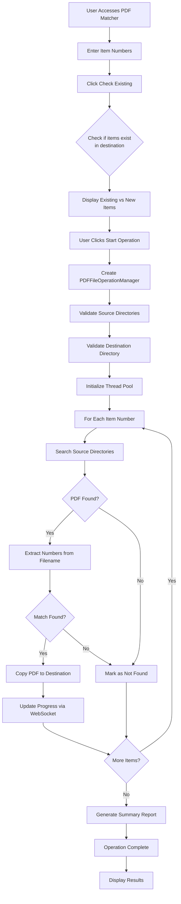

---

## 2. Serial Copier

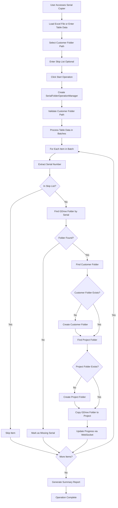

---

## 3. AI Extractor

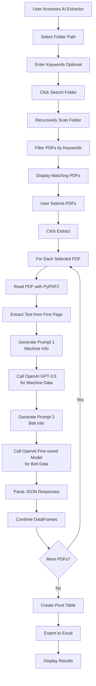

---

## 4. Machine Info Extractor

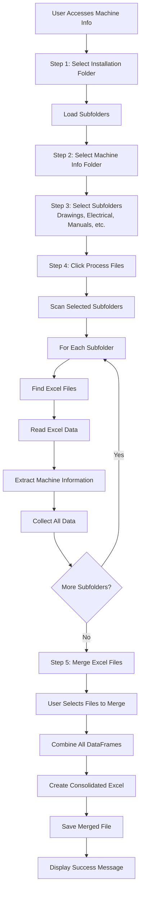

---

## 5. Excel Comparator

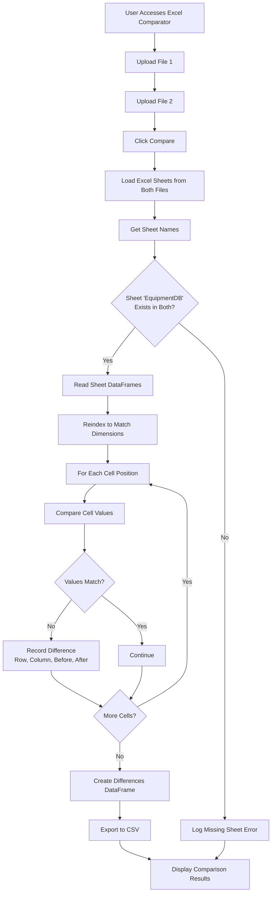

---

## 6. File Organizer

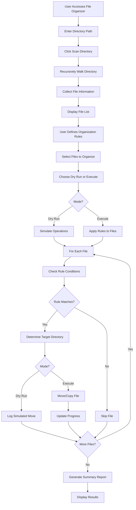

---

## 7. Serial Matcher

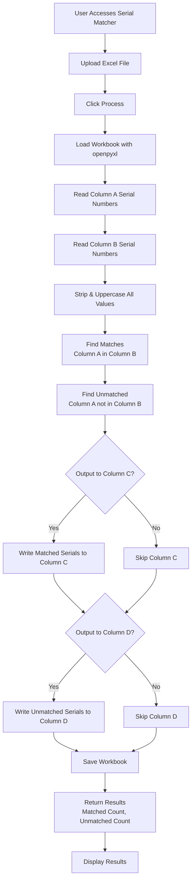

---

## 8. Duplicate Finder

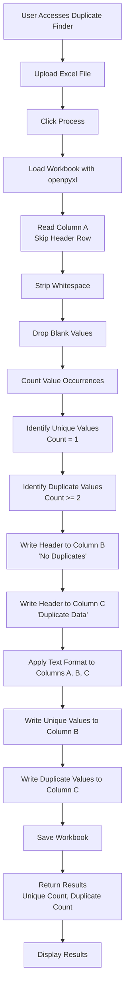

---

## 9. Part Number Formatter

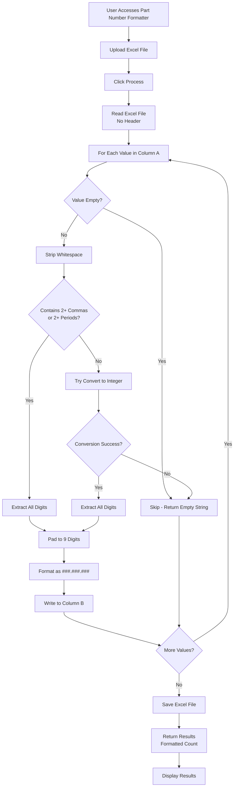

---

## 10. Filter Serial Numbers

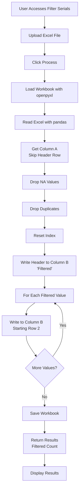

---

## 11. Spare List Formatter

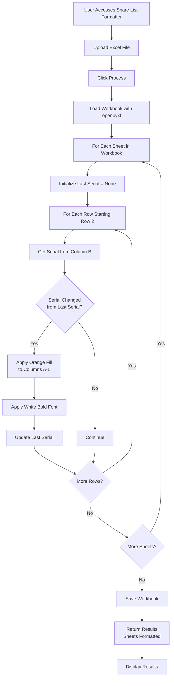

---

## 12. Part Dash Remover

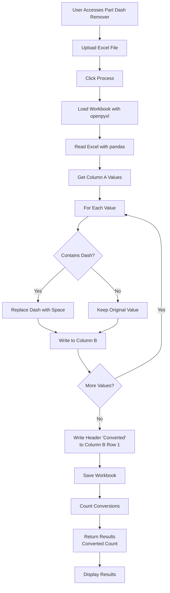

---

## 13. VDRS Sync

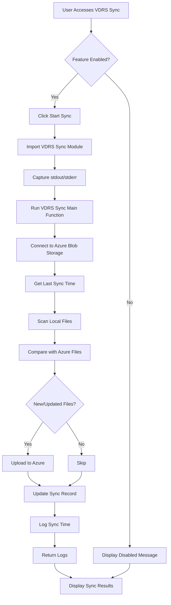

---

## 14. DataDropper

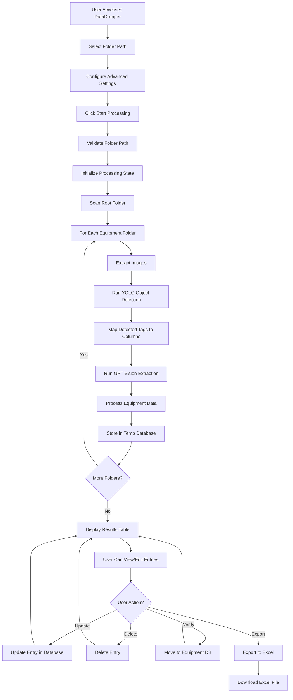

---

## 15. Parser

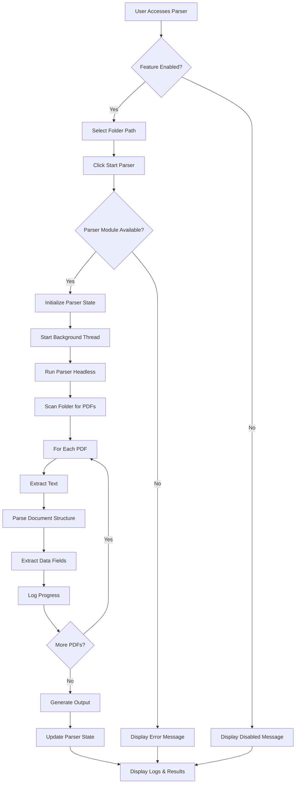

---

## 16. Pipeline 1 (YOLO Processing)

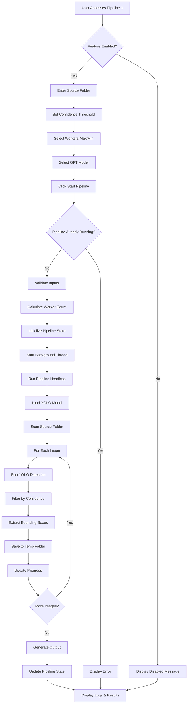

---

## 17. Pipeline 2 (GPT Processing)

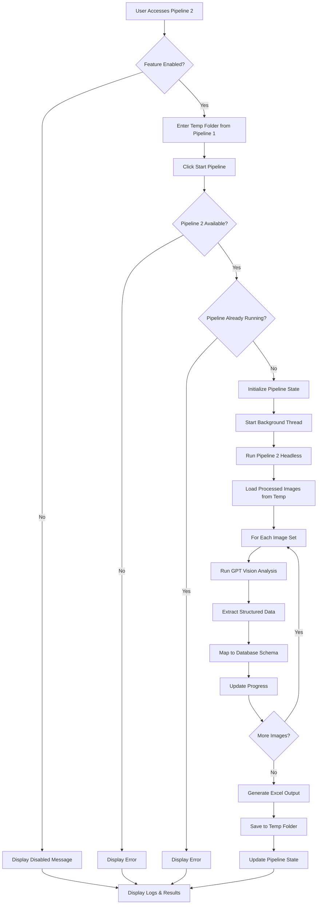

---

## 18. Folder Creator

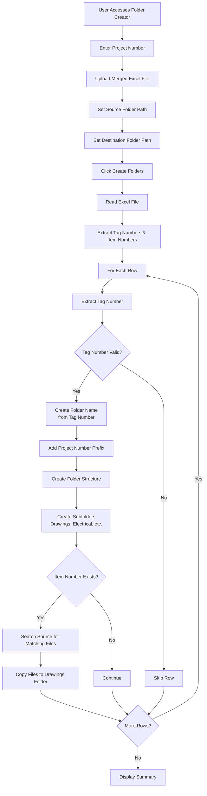

---

## 19. Drawing Extractor

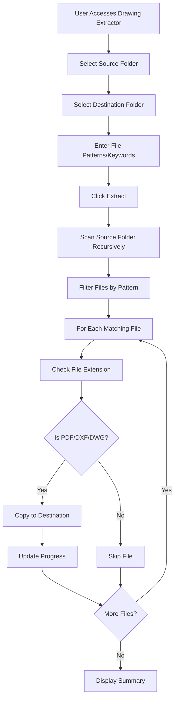

---

## 20. Folder Renamer

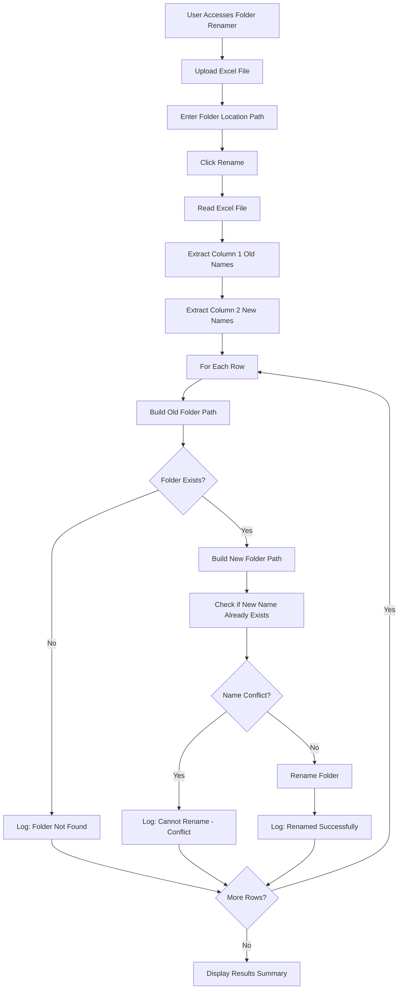

---

## Summary

This document contains flowcharts for all 20 tools in Van Dyk Tools:

1. **PDF Matcher** - Matches and copies PDFs based on item numbers
2. **Serial Copier** - Copies folders based on serial number matching
3. **AI Extractor** - Extracts data from PDFs using OpenAI GPT models
4. **Machine Info Extractor** - Extracts and merges machine information from project folders
5. **Excel Comparator** - Compares two Excel files cell-by-cell
6. **File Organizer** - Organizes files based on customizable rules
7. **Serial Matcher** - Matches serial numbers between two columns
8. **Duplicate Finder** - Finds and separates duplicate values
9. **Part Number Formatter** - Formats part numbers to standard format (###.###.###)
10. **Filter Serial Numbers** - Filters out blank values and duplicates
11. **Spare List Formatter** - Formats spare parts lists with alternating colors
12. **Part Dash Remover** - Removes dashes from part numbers
13. **VDRS Sync** - Synchronizes data with Azure Blob Storage
14. **DataDropper** - Processes equipment data with AI extraction
15. **Parser** - Parses PDF documents using AI-powered extraction
16. **Pipeline 1** - YOLO-based object detection and extraction
17. **Pipeline 2** - GPT-powered data extraction and processing
18. **Folder Creator** - Creates organized machine folders from Excel data
19. **Drawing Extractor** - Extracts drawing files based on patterns
20. **Folder Renamer** - Renames folders based on Excel mapping

Each flowchart shows the complete workflow from user input to final output, including decision points, loops, and error handling paths.

---

**Generated:** 2024-12-19  
**Version:** 1.0  
**Author:** Van Dyk Tools Documentation

